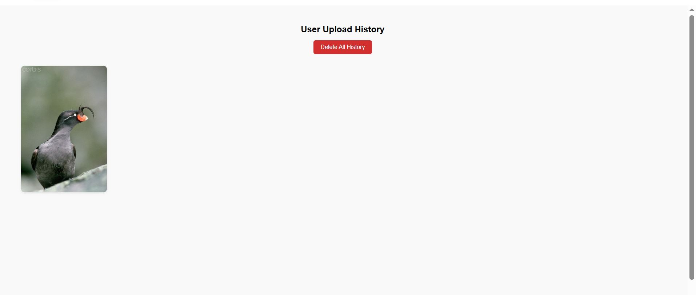

# 🐦 Bird Identifier App

A full-stack machine learning web application that enables authenticated users to upload bird images and receive species predictions using a trained deep learning model.

## Overview

Identifying bird species from images is challenging for non-experts and often requires specialized knowledge or tools.  
The Bird Identifier App simplifies this process by combining a trained deep learning model with a full-stack web interface, allowing users to upload images, receive predictions, and review their identification history through a secure, authenticated experience.

## Features
- User authentication using email and password
- Image upload with preview support
- Bird species prediction using a Python-based ML model
- Image classification powered by the CUB-200-2011 dataset
- Prediction history to review previously uploaded images and results
- Ability to delete uploaded images and clear prediction history

---


## 🖥️ Tech Stack

| Layer     | Tech Stack                          |
|----------|--------------------------------------
| Frontend | React, CSS                           |
| Backend  | Node.js, Express.js, REST APIs       |
| Auth     | JWT-based authentication             |
| Database | MongoDB (Atlas)                      |
| ML Model | Python, TensorFlow, CUB-200 Dataset  |
| Utilities| Multer (file upload), Image preprocessing |


## Screenshots

Below are key screens from the Bird Identifier application, highlighting the image upload flow, prediction results, and history tracking.

the page for uploading image 


this is how the prediction is displayed


This is the representation of history page which enables deleting of history also



## Clone the repository
```bash
git clone https://github.com/saimallesh1010/birdidentifierapp.git
cd birdidentifierapp


